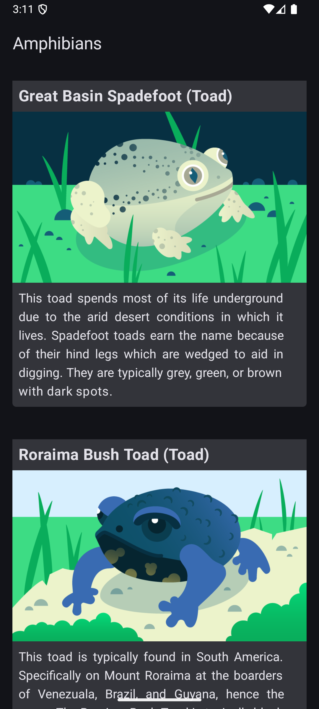

# Amphibians-App
# 🐸 Amphibians App

This is a simple Android app built with **Jetpack Compose** that displays a list of amphibians using data from a remote API. It demonstrates clean architecture practices, state handling, and UI components with modern Android development tools.

---


## 🚀 Tech Stack

- **Kotlin**
- **Jetpack Compose**
- **Material 3**
- **ViewModel & State Management**
- **Retrofit** – for making network requests
- **Coil's AsyncImage** – for loading and displaying images
- **Manual Dependency Injection** using `Application` class and `AppContainer`

---

## 📦 Key Concepts & Components

### ✅ Retrofit
Retrofit is used to make HTTP requests to a REST API. It is set up in the `DefaultAppContainer`:

```kotlin
val retrofit: Retrofit = Retrofit.Builder()
    .addConverterFactory(Json.asConverterFactory("application/json".toMediaType()))
    .baseUrl(baseUrl)
    .build()
```

The `AmphibiansApiService` interface defines the API endpoints and response structure.

---

### ✅ AsyncImage
Image loading is handled using **Coil’s `AsyncImage`** composable:

```kotlin
AsyncImage(
    model = ImageRequest.Builder(LocalContext.current)
        .data(amphibian.imgSrc)
        .build(),
    contentDescription = amphibian.name,
    contentScale = ContentScale.Crop
)
```

---

### ✅ Application Class
A custom `Application` class (`AmphibiansApplication`) is created to initialize app-wide dependencies:

```kotlin
class AmphibiansApplication : Application() {
    lateinit var container: AppContainer

    override fun onCreate() {
        super.onCreate()
        container = DefaultAppContainer()
    }
}
```

---

### ✅ AppContainer (Manual Dependency Injection)
The `AppContainer` interface defines how dependencies are provided. `DefaultAppContainer` implements it and creates instances of:

- Retrofit
- `AmphibiansApiService`
- `AmphibiansRepository`

This container is accessed from the `Application` class and injected where needed.

---

### ✅ Repository
The `AmphibiansRepository` interface abstracts the data-fetching logic. `NetworkAmphibiansRepository` implements it using the Retrofit service:

```kotlin
interface AmphibiansRepository {
    suspend fun getData(): List<AmphibiansData>
}
```

---

### ✅ Sealed Interface (UI State)
UI state is represented with a Kotlin `sealed interface` for type-safe state handling:

```kotlin
sealed interface AmphibiansUiState {
    data class Success(val amphibians: List<AmphibiansData>) : AmphibiansUiState
    object Error : AmphibiansUiState
    object Loading : AmphibiansUiState
}
```

This is used by the `ViewModel` and the UI layer (`HomeScreen`) to react accordingly.

---

### ✅ ViewModel Factory & Companion Object
Since `AmphibiansViewModel` requires a repository, a custom `Factory` is defined in a `companion object` using the `viewModelFactory {}` DSL:

```kotlin
companion object {
    val Factory: ViewModelProvider.Factory = viewModelFactory {
        initializer {
            val application = this[APPLICATION_KEY] as AmphibiansApplication
            val repository = application.container.amphibiansRepository
            AmphibiansViewModel(repository)
        }
    }
}
```

This factory allows Compose to create the ViewModel with injected dependencies.

---

## 🖼️ UI Overview

- The app uses `Scaffold`, `LazyColumn`, and `Card` to build a clean and scrollable list layout.
- Each amphibian is shown using a custom `AmphibianCard` with name, type, image, and description.
- The top bar is implemented using `TopAppBar`.

---

## 📂 Project Structure

```
├── data/
│   ├── AppContainer.kt
│   └── AmphibiansRepository.kt
│
├── model/
│   └── AmphibiansData.kt
│
├── network/
│   └── AmphibiansApiService.kt
│
├── ui/screens/
│   ├── HomeScreen.kt
│   └── AmphibiansViewModel.kt
│
├── AmphibiansApplication.kt
```

---

## 🧪 Preview Support

Design previews are included using `@Preview` with mocked `AmphibiansData` and `AmphibiansUiState`.

---

## 📦 Getting Started

1. Clone the repo
2. Open in Android Studio
3. Run the app on an emulator or physical device

---

## 📜 License

This app is for learning purposes and is based on the Android Developers' Compose Codelab. Modify and use it freely!